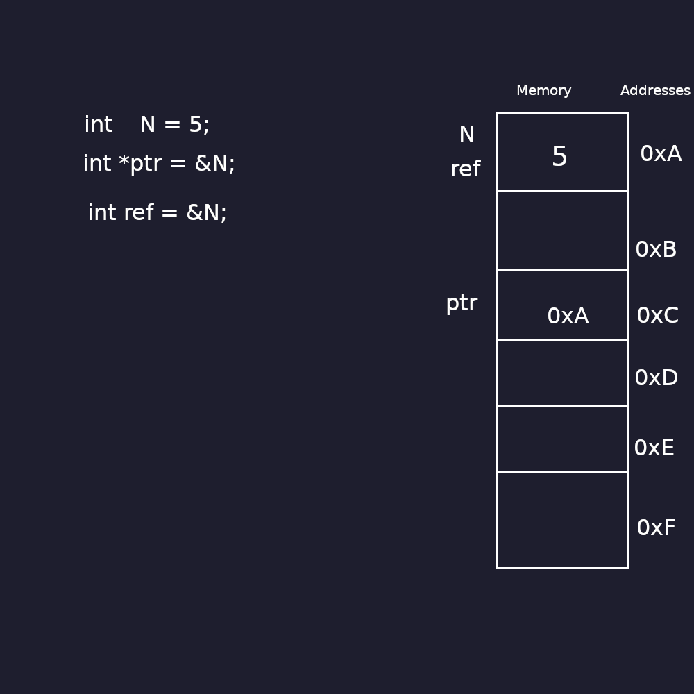

# CPP Module 01

## EX 00
For this assignment it was asked to us to implement a zombie and it has to announce itself.

After it, we nned to create two functions:

```Zombie* newZombie( std::string name );```

```void randomChump( std::string name );```

And finnaly for debugging porpuses it has to show a message when a zombie is destroyed which is quite easy, you just need to leave a message in the destructor.

This exercise it to teach us the difference between allocating in the stack vs. the heap.

Allocating in the stack means storing data in a region of memory that's fast and automatically managed. It's used for temporary data like function parameters and local variables. When a function ends, its stack data is automatically removed.

Allocating in the heap means storing data in a region of memory that's manually managed. It's used for dynamic memory—like objects or data structures whose size or lifetime isn’t known at compile time. You must explicitly allocate and free this memory.

## EX 01

For this one, it was asked to us to create a function that returns a pointer to the first position of an array. The function must allocate N number of Zombies and assign to each Zombies the name passed as paramenter:

```Zombie* zombieHorde(int N, std::string name);```

Everything is the same as the previous assignment but for the function you just need to create a collection of instances of the Zombie class with ```new``` keyword, and use a loop to set the name to each instance.

# EX 02

This assignment was made to learn what a reference and a pointer is.
pointers are a concept learnt with C and their definition didnt change.
while pointers are variables that store the addres of the variable they are pointing to.
references are like aliases for existing variables.
when declaring a reference like:
int &ref = a;
a and ref both refer to the same thing so it means that if we alter one, it changes the value for "both", it is kind confusing so this picture may explain better:


## EX 03

In this assignment we will implement references.
We will implement a Weapon class with a attribute ```type``` which is a string.
Two member functions:
``` getType()```
``` setType()```
to get and set the weapon type.

Then we will create two classes, HumanA and HumanB, both have a weapon, a name and a method ```attack```, that displays something like:
```<name> attacks with their <weapon type>```

HumanA and HumanB differ at the constructor, HumanA will take a weapon in its constructor and HumanB will not.

This exercise its to show a fundamental thing about references, while pointers can inittialy be NULL references cannot.

## EX 04

This one was my favorite, it askes to make a program that takes three parameters, a filename and two strings s1 and s2. It must open the file and replace every occurence of s1 with s2.

Firstly I worked on making the replace file, I used substr to return the filename until the dot (.) eg. filename.txt will return only filename, then I was just create a file with the filename + .replace and copy all of the content of the original file to this new .replace file.

To copy I used getline to read and pass all the file contents and pass the lines to a string array eg.:```std::string *arr```.

After having both the filename.txt and filename.replace, we start replacing every instance of the s1 with s2.
The method I choose some may say that is a little convoluted but is what I thought at the time, I first take the previous string array and split each line and then insert word for word in the new file, but if the current word is equal to s1 i just switch the current word for s2. I will put bellow a picture to explain better.


EX05

