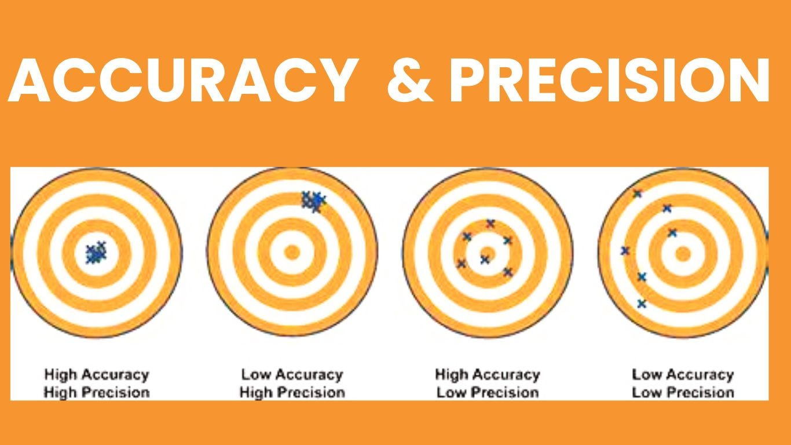

# MODULE 02 OF THE CPP SERIES

## Orthodox Canonical Form

The	Orthodox Canonical Form refers to a set of special functions that a class should define or delete, to manage resources correctly.

It includes:
1.	A default Constructor		[ MyClass() ]
2.	Copy Constructor			[ MyClass(const MyClass &other)]
3.	Copy Assignment Operator	
4.	A destructor

## EX 00

Before anything we need to understand how floating point numbers work.

Following IEEE-754, to represent real floating point numbers, because computers have finite memory most systems trade accuracy with precision. making them capable of representing vaery large or small values with aproximate correctness.

### Accuracy vc. precision

Accuracy refers to how close a measurement is to the true or accepted value. Precision refers to how close measurements of the same item are to each other.

The image above shows an example.
 - High accuracy and precission would be a collection of values that are equal and really close to the value we are measuring
 - Low accuracy and High precision would be a collection of values that are equal but far away from the value we are measuring
 - High accuracy and low precision would be a collection of values that are different but close to the value we are measuring
 - Low accuracy and low precision would just be a mess lmao.

### Disadvantages of floating point numbers

* Due to rounding errors, comparing floats using '==' can lead to unusual behaviour.

* Subtracting nearly equal floats can destroy precision

* Adding very small numbers to very large ones can result in the small values being lost.

### Internal Representation

A 32-bit floating point number is stored in binary, the 32 bits are divided into three parts:

#### Sign bit

This simple tells you if a number is positive or negative.

#### Exponent

This scales the number up or down — like the power of 2 in scientific notation.
Bias-127: IEEE-754 uses a "bias" to allow both positive and negative exponents.
The stored exponent is offset by 127.
So if the stored bits are 10000001 (which is 129), the actual exponent is 129 - 127 = 2.
This allows the exponent to range from -126 to +127 (not including special values like all-zeros or all-ones).

#### Mantissa

Also called the fraction or significand.
Represents the precision bits of the number.
IEEE floats assume a leading 1 before the binary point (this is called "normalization"), so only the fractional part is stored.
For example, if the real binary number is 1.10101, only 10101... is stored in the mantissa.

### Fixed point

Let's now dive in fixed point numbers.

Fixed point representation offers a way to represent real fractional numbers in a more efficient and faster way.

Instead of storing the decimal or binary point dynamically like in floating point, fixed point numbers have a binary point at a fixed position. This allows fractional values to be represented using integer hardware, which is faster and simpler.

Although fixed point numbers have its pros, one drawback that you might want to consider is loss of precision.