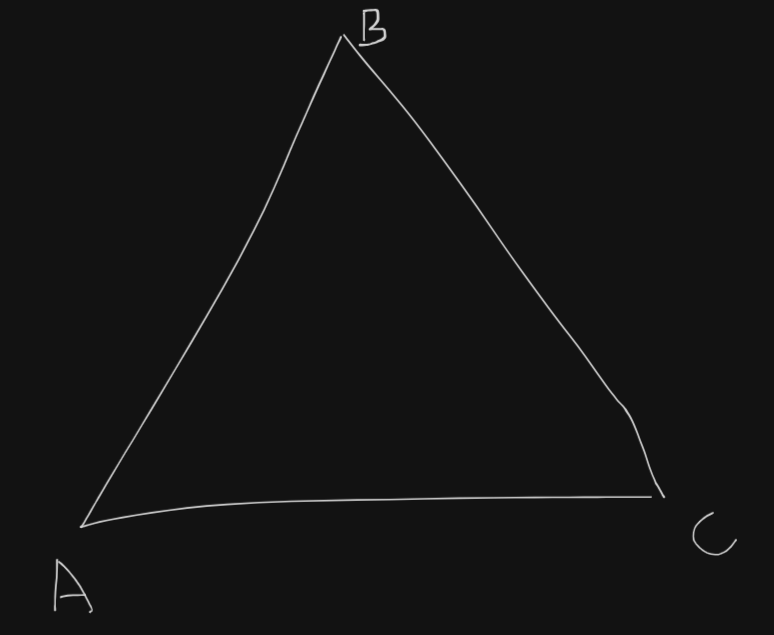
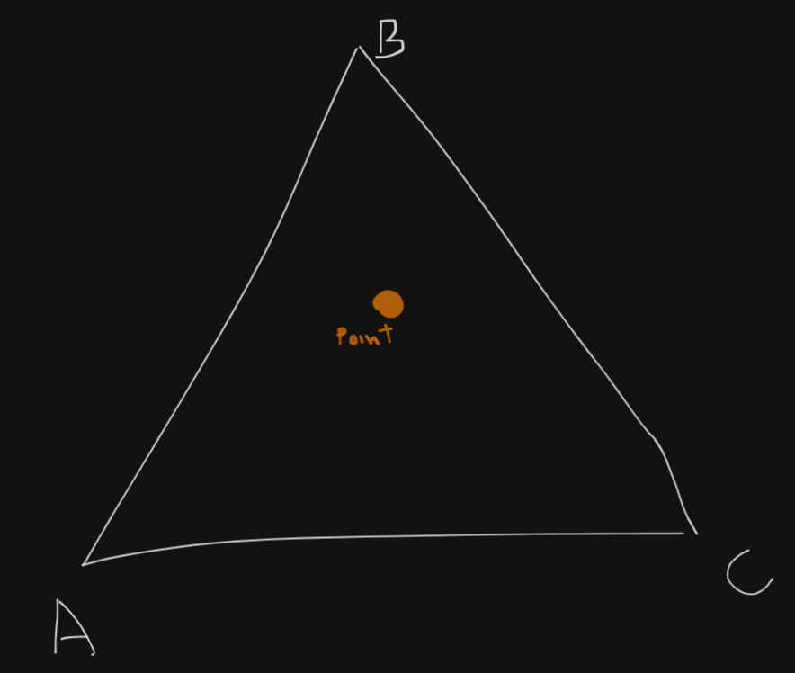

# MODULE 02 OF THE CPP SERIES

## Orthodox Canonical Form

The	Orthodox Canonical Form refers to a set of special functions that a class should define or delete, to manage resources correctly.

It includes:
1.	A default Constructor		[ MyClass() ]
2.	Copy Constructor			[ MyClass(const MyClass &other)]
3.	Copy Assignment Operator	
4.	A destructor

## EX 00

Before anything we need to understand how floating point numbers work.

Following IEEE-754, to represent real floating point numbers, because computers have finite memory most systems trade accuracy with precision. making them capable of representing vaery large or small values with aproximate correctness.

### Accuracy vc. precision

Accuracy refers to how close a measurement is to the true or accepted value. Precision refers to how close measurements of the same item are to each other.


The image above shows an example.
 - High accuracy and precission would be a collection of values that are equal and really close to the value we are measuring
 - Low accuracy and High precision would be a collection of values that are equal but far away from the value we are measuring
 - High accuracy and low precision would be a collection of values that are different but close to the value we are measuring
 - Low accuracy and low precision would just be a mess lmao.

### Disadvantages of floating point numbers

* Due to rounding errors, comparing floats using '==' can lead to unusual behaviour.

* Subtracting nearly equal floats can destroy precision

* Adding very small numbers to very large ones can result in the small values being lost.

### Internal Representation

A 32-bit floating point number is stored in binary, the 32 bits are divided into three parts:

#### Sign bit

This simple tells you if a number is positive or negative.

#### Exponent

This scales the number up or down — like the power of 2 in scientific notation.
Bias-127: IEEE-754 uses a "bias" to allow both positive and negative exponents.
The stored exponent is offset by 127.
So if the stored bits are 10000001 (which is 129), the actual exponent is 129 - 127 = 2.
This allows the exponent to range from -126 to +127 (not including special values like all-zeros or all-ones).

#### Mantissa

Also called the fraction or significand.
Represents the precision bits of the number.
IEEE floats assume a leading 1 before the binary point (this is called "normalization"), so only the fractional part is stored.
For example, if the real binary number is 1.10101, only 10101... is stored in the mantissa.

### Fixed point

Let's now dive in fixed point numbers.

Fixed point representation offers a way to represent real fractional numbers in a more efficient and faster way.

Instead of storing the decimal or binary point dynamically like in floating point, fixed point numbers have a binary point at a fixed position. This allows fractional values to be represented using integer hardware, which is faster and simpler.

Although fixed point numbers have its pros, one drawback that you might want to consider is loss of precision.

## EX 00

This assignment is just to get us acquainted to classes made with ```orthodox canonical form```.

They ask us to create a class ```Fixed``` with two private members, one integer to store the fixed point values, and another, which is constant to store the number of bits which is 8.

For the public members it should have:

 - A default constructor
 - A copy constructor
 - A copy assignment operator overload
 - A destructor
 - A member function to get the raw value of the fixed-point
 - A member function to set the raw value of the fixed-point

These requirements are quite easy to accomplish, you just the tricky thing here is really undestand the concepts, for copy and copy assignment methods, the point for these two is to instantiate your class copying another contents from another object, here you decide what will be the behavior for you object in these kind of scenarios.

## EX 01

In here we work to build a more complex class, I think that the pedago team wanted to make us more confortable with tweaking more our class, classes allow us to decide how we will intantiate them and destroy them, which is basically what we will do in this assignment .

We are assigned to add the following constructors and member functions to our class:
 - A constructor that takes a constant integer as a parameter, it converts to the corresponding fixed-point value, the fractional bits value should be initialized to 8 like the previous exercise, this applies to the rest of the constructors.
 - a constructor that takes a constant floating-point number as a parameter, it converts to the corresponding fixed-point value.
 - a member function ```float toFloat(void) const;```, it converts the fixed-point value to floating point value.
 - a member function ```float toInt(void) const;```, it converts the fixed-point value to an integer value.
 - Finally, add an overload of the insertion («) operator that inserts a floating-point representationof the fixed-point number into the output stream object passed as a parameter.

For the constructor that takes an integer, you just do this: 

```
Fixed::Fixed(const int n)
{
	std::cout << "Int constructor called" << std::endl;
	fixed_point = n << bits;
}
```

This basically bit shifts 'n' to the left by the determined number of bits that is based of you class, that is called the scaling factor, and allows you to represent the fixed-point value of an integer.

For the ```int toInt(void) const;``` function, you just need to shift back to the right, like this:

```
int	Fixed::toInt(void) const
{
	return (fixed_point >> bits);
}
```

To make the constructor with a floating point number is a bit more complicated:

```
Fixed::Fixed(const float float_value)
{
	std::cout << "Float constructor called\n";
	fixed_point = static_cast<int>(roundf(float_value * (1 << bits)));
}
```
In ```float_value * (1 << bits)``` it scales ```float_value```  scales the float into a fixed-point space.
And ```roundf()```it rounds the result to the nearest integer, so a tiny bit of data is lost but nothing significant.

And of course the operation to convert the bits to float:

```
float Fixed::toFloat(void) const
{
	return (static_cast<float>(fixed_point) / (1 << bits));
}
```

For the insertion operator, we define like this:

```
std::ostream& operator<<(std::ostream &out, const Fixed &fixed)
{
	out << fixed.toFloat();
	return (out);
}
```
This uses the ```toFloat()``` method to convert the fixed-point value to a float, and then inserts that into the stream.

## EX 02

In this assignment, which is an extension of the previous one, we will dive more into operator overloading, which is a way to allow the programmer to extend the functionality of existing operators to work with user-defined classes. We had a glimpse of what it is before with the insertion operator and in here we will implement 10 more, 6 for comparison and 4 for aritmetic operations. (>; <; <=; >=; ==; !=; +; -; *; /).

Also 4 methods: 

 - A static member function min that takes two references to fixed-point numbers as parameters, and returns a reference to the smallest one.
 - A static member function min that takes two references to constant fixed-point numbers as parameters, and returns a reference to the smallest one.
 - A static member function max that takes two references to fixed-point numbers as parameters, and returns a reference to the greatest one.
 - A static member function max that takes two references to constant fixed-point numbers as parameters, and returns a reference to the greatest one.

I will just show some examples and the explain them because it gets a little repetitive.

Basically for every operator to compare two ```Fixed``` objects you can do this:

```
bool Fixed::operator>=(const Fixed& other) const
{
	return (fixed_point >= other.fixed_point);
}
```

This for arithmetic operators:

```
Fixed Fixed::operator+(const Fixed& other) const
{
	Fixed res;

	res.setRawBits(this->getRawBits() + other.getRawBits());
	return (res);
} 
```

Oh, I forgot, for division and multiplication you have to account the scaling factor, so it doesn't scale logarithmically or exponentially the bits value, here I used 256 just because 2^nbits, with nbits being 8 is equal to 256:

```
Fixed Fixed::operator*(const Fixed& other) const
{
	Fixed res;

	res.setRawBits((this->getRawBits() / 256) * other.getRawBits());
	return (res);
}

Fixed Fixed::operator/(const Fixed& other) const
{
	Fixed res;

	res.setRawBits((this->getRawBits() * 256) / other.getRawBits());
	return (res);
}
```

I won't even explain for min\max, they are really easy, come on man...

## EX03

This was my favorite assignment, but unfortunately it was not very long :(.

We it asked to us to implement a class named ```Point```, it contains 2 ```Fixed-Point``` classes. It is quite interesting because to write this in a Orthodox Canonical way, we have to use the constructors of the Fixed-Point subclasses. I will not show here how, for educational porpuses, not because I am lazy at all.

With this Point class we have to implement the following function:

```
bool bsp( Point const a, Point const b, Point const c, Point const point)
```

It finds if a point in a 2D plane is inside or not of a triangle.
 - a, b, c: The vertices of a triangle.
 - point: The point to check.
 - Returns: True if the point is inside the triangle. False otherwise. Thus, if the point is a vertex or on an edge, it will return False.

The solution it is quite simple, imagine this triangle: (the dimentions are irrelevant for the explanation)



There are Three main cases for this assignment. In the three of them you first will need to find the total area of the triangle using the 3 points a, b and c.

if the point is inside:



You can make 3 triangles with that points:


if you calculate the sum of the three areas of the small triangles and if its equal to the area of the main triangle, it means that the point is inside.

The other case is if the point is outside:

I don't think I need to illustrate, but you will still need to create three mini-triangles, just as before, (Point-B-C) (A-Point-C) and (A-B-Point)

When you do this, the area will never be equal to the area of the total area of triangle. So in this case it must return false.

The third case is if the point is inside one of the segments.

You will in this case only make two triangles:


In this case, A3 will be nonexistent, but the sum all of the triangle will still be equal to the big triangle. Thats all, thanks for reading this mess till here, writing this stuff is so exausting.